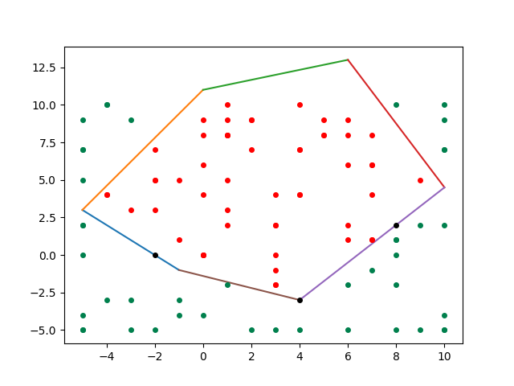
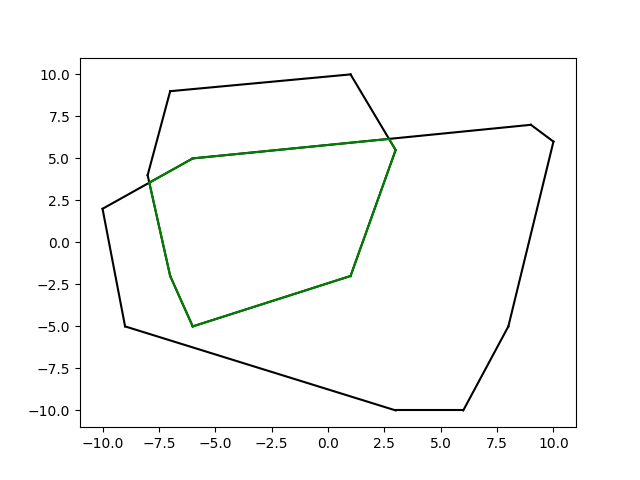
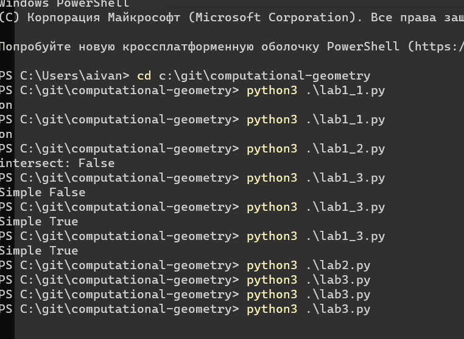
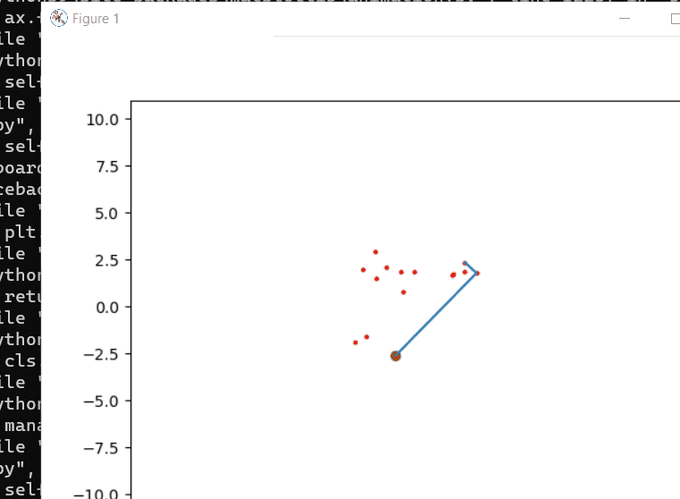
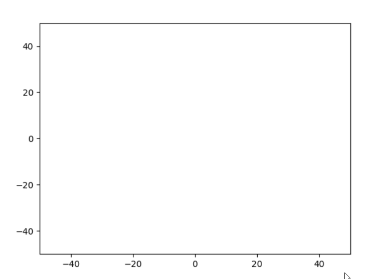
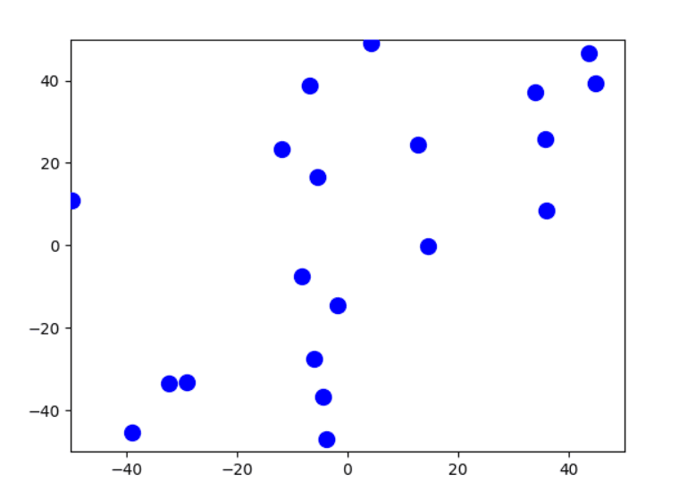
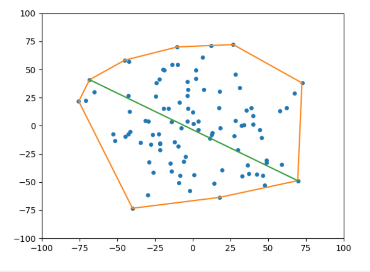
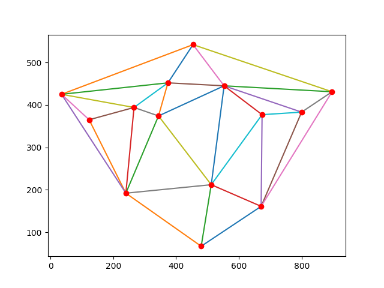

# Computational Geometry
My university Computational Geometry course
You need to install matplotlib for this
Some examples is here:
* Is point inside or outside of figure
* Intersection of 2 figures
* Dynamic bezier curve with animation
* Detecting collision and bounce calculation
* Convex hull
* Dynamic convex hull
* Divide and conquer algorithm: detecting the 2 closest points
* Find convex hull and diameter of a set of points
* Triangulation
